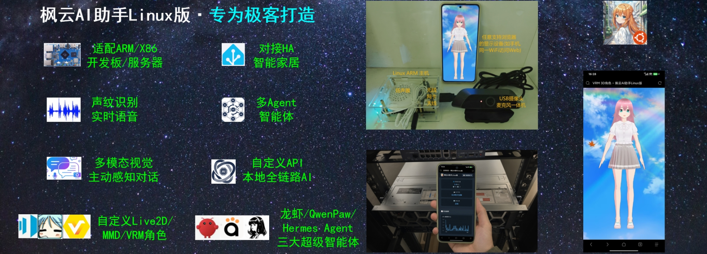
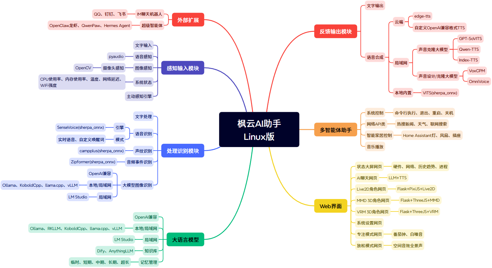

# 枫云AI助手Linux版

  

**枫云AI助手Linux版**是由MewCo-AI团队开源的AI助手，专为Linux用户打造（同时适配ARM小型设备如树莓派、香橙派、Orin等）。它集成了声纹识别语音交互、多模态图像识别、Live2D/MMD/VRM虚拟角色、主动感知对话、IM机器人接入以及三大超级智能体（OpenClaw/QwenPaw/Hermes Agent）等丰富功能，并支持通过浏览器从局域网内任意设备访问。

> **当前版本：v4.3** – 新增超级智能体框架接入、IM机器人（飞书/钉钉/QQ）、Home Assistant家居控制、系统命令执行、主机状态趋势图、专注模式、放松模式、跨端互联等。

---

## 功能一览

- **全平台访问**：Linux主机运行后，局域网内电脑/手机/平板均可通过浏览器访问。
- **多种交互方式**：文字（Web）、语音（实时/唤醒词）、图像（摄像头）输入，输出含文字、语音合成、虚拟形象动画。
- **丰富的AI生态**：对接云端（OpenAI兼容等）及本地/局域网（llama.cpp、KoboldCpp、vLLM、LM Studio、Dify等）大语言模型框架、视觉模型、语音合成引擎。
- **多智能体与超级智能体**：内置联网搜索、天气、新闻、智能家居控制、系统命令执行等智能体，并可接入OpenClaw/QwenPaw/Hermes Agent三大超级智能体框架。
- **IM机器人接入**：支持飞书、钉钉、QQ机器人，可与即时通讯软件无缝集成。
- **虚拟形象展示**：支持Live2D 2D角色、MMD 3D角色、VRM 3D角色，自动口型同步与互动动画。
- **主机状态监控**：CPU、内存、温度、进程、网络带宽、系统负载等历史趋势图表。
- **专注模式**：内置番茄钟和背景音，可添加任务清单。
- **放松模式**：内置9种空间音效沉浸白噪音（春风、海滩、森林、溪流、夏夜、雨天等），支持定时停止。




---

## 支持的AI引擎

### 大语言模型

| 类型 | 支持模型/引擎 | 说明 |
|------|-------------|------|
| 云端 | OpenAI兼容（DeepSeek、Qwen、GLM等） | 需API Key |
| 本地/局域网 | KoboldCpp、llama.cpp、vLLM、LM Studio、Ollama、Dify、AnythingLLM、RKLLM（NPU加速） | 支持无网/离线运行 |

### 语音合成（TTS）

| 类型 | 引擎 | 说明 |
|------|------|------|
| 云端 | Edge-TTS、CustomTTS (OpenAI兼容) | 多音色、可调语速/音高 |
| 局域网 | GPT-SoVITS、Qwen-TTS、Index-TTS、OmniVoice、VoxCPM | 支持声音克隆或声音设计 |
| 本地内置 | VITS-ONNX (sherpa-onnx) | 内置模型，无需网络 |

### 图像识别（VLM）

支持 OpenAI兼容API、Ollama、LM Studio、KoboldCpp、llama.cpp、vLLM 等视觉模型引擎。

---

## 核心交互流程

系统整体分为**输入→识别→处理→输出**四个环节：

1. **输入**：支持文字（Web）、语音（麦克风）、图像（摄像头）三种方式。
2. **识别**：
   - 语音识别基于 SenseVoice（sherpa-onnx），支持多语言高精度识别，可选实时或唤醒词模式。
   - 声纹识别（3D-Speaker）可限制仅响应特定用户。
   - 音频事件检测（Zipformer）可识别口哨、敲门、交通音等环境声音。
   - 图像识别调用所配置的视觉模型引擎。
3. **处理**：
   - 在**提示词模式**下，所有请求直接由大语言模型处理。
   - 在**多智能体模式**下，系统通过意图识别路由至对应智能体（详见下方列表）。
   - 在**超级智能体模式**下，接入 OpenClaw、QwenPaw 或 Hermes Agent 框架执行复杂任务。
4. **输出**：文字显示、语音合成（流式/非流式）以及虚拟形象的口型同步与肢体动画。

---

## 运行模式

用户可通过软件设置自由切换以下五种运行模式：

- **提示词对话**：直接与LLM进行自由对话，所有请求由LLM处理。
- **多智能体助手**：系统自动识别用户意图，调用对应内置智能体（如天气、新闻、智能家居等）。
- **OpenClaw**：接入通用任务编排型超级智能体，擅长工具调用与技能扩展。
- **QwenPaw**：专注于个人助理场景，强调数据自主与记忆进化。
- **Hermes Agent**：具备自我进化的Skill系统和持久化记忆，在编程和长链推理任务上表现突出。

---

## 多智能体列表（多智能体模式下可用）

| 智能体 | 调用示例 | 功能描述                           |
|--------|----------|--------------------------------|
| 音乐播放 | “唱首歌” / “放点音乐” | 播放 `data/music/` 下的本地MP3       |
| 摄像头问答 | “你看到了什么” | 分析摄像头画面内容                      |
| 灯具控制 | “把灯打开” / “关灯” | Home Assistant智能灯控制            |
| 风扇控制 | “打开风扇” / “关掉风扇” | Home Assistant风扇控制             |
| 插座控制 | “把插座打开” / “关插座” | Home Assistant插座控制             |
| 天气查询 | “今天天气怎么样” | 查询指定城市天气（wttr.in）              |
| 热搜新闻 | “今天有什么新闻” | 抓取RSS热点并总结                     |
| 系统状态 | “系统状态怎么样” | 返回CPU/内存/温度/网络等信息              |
| 联网搜索 | “帮我搜索人工智能” | 百度搜索并总结结果                      |
| IP查询 | “本机IP是多少” | 返回本机局域网IP与访问地址                 |
| 切换语音模式 | “切换到唤醒词模式” | 切换实时/唤醒词识别                     |
| 切换主动感知 | “开启主动对话” | 切换主动感知对话开关                     |
| 系统命令执行 | “查看当前目录文件” | 执行Linux命令（不会执行黑名单内高危命令） |
| 确认删除记忆 | “确认删除记忆” | 清空对话历史                         |
| 确认退出/重启/关机 | “确认退出”等 | 退出程序或系统操作（需sudo）               |
| 日常闲聊 | “讲个笑话” | 普通对话交流                         |

---

## IM机器人接入

在软件设置中开启对应开关并配置凭证后，即可通过企业通讯软件与AI助手交互：

| 平台 | 配置项 | 说明 |
|------|--------|------|
| **飞书** | AppID + AppSecret | 基于lark-oapi SDK，WebSocket事件订阅 |
| **钉钉** | ClientID + ClientSecret | 基于dingtalk-stream SDK，Stream模式 |
| **QQ** | AppID + AppSecret | 基于botpy SDK，支持C2C私聊 |

---

## Web 功能页面

项目内置了多个独立网页，通过浏览器访问根地址后点击功能菜单即可体验：

| 页面 | 路径 | 功能描述 |
|------|------|----------|
| 主机状态 | `/` | 显示CPU、内存、温度、进程、网络、磁盘IO实时数据及历史趋势图，Top进程监控 |
| AI聊天 | `/chat` | 文字聊天界面，支持语音播放助手回复 |
| 软件设置 | `/settings` | 图形化配置所有参数（AI引擎、API密钥、家居控制、IM机器人等） |
| Live2D角色 | `/live2d` | 2D虚拟形象，自动口型同步 |
| MMD 3D角色 | `/mmd` | 3D虚拟形象，自动口型同步（需模型文件） |
| MMD 动作 | `/vmd` | 播放VMD动作文件 |
| VRM 3D角色 | `/vrm` | 3D虚拟形象，支持点击肢体互动（点头、挥手等），自动口型同步 |
| 跨端互联 | `/link` | 生成访问二维码及局域网地址，方便移动设备扫码 |
| 专注模式 | `/focus_mode` | 番茄钟计时器，可自定义时长、休息间隔，并管理任务清单（本地存储） |
| 放松模式 | `/relax_mode` | 播放白噪音（9种），支持定时停止、音量调节 |

---

## 安装指南

### 环境要求

| 项目 | 要求 |
|------|------|
| 操作系统 | Ubuntu 22.04 或兼容Linux发行版 |
| Python版本 | 3.12 |
| 处理器 | RK3566（最低）/ RK3576（中端）/ RK3588S（高端）/ X86_64 |
| 内存 | 4GB RAM（最低）/ 8GB RAM（推荐） |
| 存储 | ≥4GB可用空间 |
| 网络 | 可联网使用，也可离线使用本地AI引擎DLC |
| 麦克风/摄像头/扬声器 | 按需配备（语音输入/图像输入/语音输出） |

### 下载和安装
风险提示：建议内网运行本项目，不建议部署在公网服务器。私有内网穿透推荐使用Tailscale。

#### 方法一（推荐）：整合包（自带模型）
1. 访问[项目官网](https://mewco-ai.github.io/2025/05/17/asstlinux/)，点击"自带模型的整合包(Linux)"，下载 `mewco_ai_assistant_linux.zip` 并解压。
2. 安装系统依赖：
```bash
sudo apt update
sudo apt install cmake libasound-dev portaudio19-dev libportaudio2 libportaudiocpp0
```
3. 推荐使用conda环境：
```bash
conda create -n maial python=3.12
conda activate maial
pip install -r requirements.txt
```

#### 方法二：源码安装
1. 克隆项目：
```bash
git clone https://github.com/MewCo-AI/mewco_ai_assistant_linux.git
cd mewco_ai_assistant_linux
```
2. 安装系统依赖（同上）。
3. 安装Python依赖（同上）。
4. 下载必备AI模型包：从[网盘](https://pan.baidu.com/s/18n5mJ0hnRn_XPsdUsGk6TQ?pwd=maia)下载 `model.zip`，解压后将其中的四个模型文件夹放入 `data/model/`文件夹。

### 硬件接口测试
进入 `test` 目录，分别运行测试程序获取硬件编号（摄像头、麦克风、温度传感器、扬声器），后续在软件设置网页中填入对应的编号。
```bash
cd test
python cam_test.py      # 摄像头
python mic_test.py      # 麦克风
python sensor_test.py   # 温度传感器
python speaker_test.py  # 扬声器
```

### 运行项目
```bash
conda activate maial
python main.py
```
启动后控制台会显示各服务地址（默认端口5260），通过浏览器访问即可，网页默认密码为 mewco168，建议前往网页右上角功能菜单→软件设置→基本信息，修改为其他密码。

---

## 项目结构

```
mewco_ai_assistant_linux/
├── data/                           # 数据文件
│   ├── audio/                      # 音效（welcome.mp3, relax_mode/*.mp3）
│   ├── cache/                      # 缓存（录音、语音合成）
│   ├── db/                         # 配置、记忆数据库
│   ├── image/                      # 图片资源文件
│   ├── model/                      # AI模型（ASR/SpeakerID/AudioTag/TTS）
│   ├── music/                      # 本地音乐（MP3）
│   └── voiceprint/                 # 用户声纹文件
├── dist/                           # 静态Web资源
│   ├── web_*.html                  # 各功能页面（chat/link/live2d/mmd/vmd/vrm/settings/state/focus_mode/relax_mode）
│   └── assets/                     # 图片、Live2D/MMD/VRM核心库与模型
├── test/                           # 硬件测试脚本
├── agent.py                        # 意图识别与路由
├── asr.py                          # 语音/声纹/音频事件识别
├── function.py                     # 智能体功能实现（音乐、家居、网络等）
├── function_web.py                 # Web监控专用函数（进程、IO、网络速度）
├── harness.py                      # 三大超级智能体接口（OpenClaw/QwenPaw/Hermes）
├── im_bot.py                       # 飞书/钉钉/QQ机器人
├── llm.py                          # LLM对话与记忆管理
├── main.py                         # 主程序入口
├── sys_init.py                     # 配置加载
├── tts.py                          # 语音合成（多引擎）
├── vlm.py                          # 图像识别
├── web_server.py                   # Flask服务（所有页面和API）
└── requirements.txt
```

---

## 配置说明

配置文件位于 `data/db/config.json`，首次启动自动生成。所有配置项均可通过软件设置网页（`/settings`）修改，保存后需重启生效。

---

## 使用说明

### 语音交互
- **实时语音模式**：默认，麦克风采集到语音后自动识别并回复。
- **唤醒词模式**：在软件设置中将“语音识别模式”设为 `WakeWord`，并设置自定义唤醒词（如“你好”），说出包含唤醒词的语音后触发回复。

### 文字交互
- **Web聊天**：访问 `/chat` 页面输入文字。

### IM机器人交互
配置并开启后，机器人会自动接收私聊消息并回复（支持飞书/钉钉/QQ C2C）。

### 虚拟形象交互
- **Live2D**：自动根据语音播放口型动画。
- **MMD 3D**：自动口型同步；`/vmd` 页面可播放VMD动作文件。
- **VRM 3D**：自动口型同步；点击模型不同部位触发相应互动（点头、挥手、抬腿等）。

### 专注模式
- 可自定义专注时长、背景音、短休息、长休息及轮数。
- 支持任务清单（本地存储），快捷键：空格（开始/暂停）、R（重置）、S（跳过）。

### 放松模式
- 点击任意白噪音卡片播放，支持多音轨叠加。
- 可设置定时停止（分钟），音量滑块调节。
- 支持空间音效全景声和环绕声，建议佩戴耳机以获得最佳体验。

---

## 故障排除

常见问题及快速定位：
- **麦克风/摄像头无法识别**：先运行 `test/` 目录下的对应测试程序，确认硬件编号正确且无占用。
- **AI服务连接失败**：检查网络、API密钥和账户配额；本地引擎（llama.cpp等）确认服务已启动。
- **IM机器人无法连接**：检查AppID/Secret配置，确认应用权限和事件订阅地址。
- **TTS无声音**：检查扬声器及 `prefer_tts` 配置；局域网引擎确保API服务启动。
- **唤醒词不响应**：确认模式为 `WakeWord`，唤醒词与语音内容匹配。

详细日志直接输出到控制台，可据此排查。

---

## 开发与扩展

- **添加新智能体**：在 `function.py` 实现功能 → 在 `agent.py` 的 `all_task` 添加意图描述 → 在 `intent_handler_map` 添加映射。
- **新增AI引擎**：在 `llm.py`/`tts.py`/`vlm.py` 中按现有分支模式添加新引擎支持。
- **扩展IM平台**：参考 `im_bot.py` 中飞书/钉钉/QQ的实现，使用对应SDK添加新平台。

---

## 开源协议

本项目采用 **GPL-3.0** 协议，详见 [LICENSE](LICENSE)。

## 致谢

感谢以下等开源项目及所有贡献者：[GPT-SoVITS](https://github.com/RVC-Boss/GPT-SoVITS)、[OpenCV](https://github.com/opencv/opencv-python)、[sherpa-onnx](https://github.com/k2-fsa/sherpa-onnx)、[Edge-TTS](https://github.com/rany2/edge-tts)、[QwenLM](https://github.com/QwenLM)、[llama.cpp](https://github.com/ggml-org/llama.cpp)、[Flask](https://github.com/pallets/flask)、[live2d-chatbot-demo](https://github.com/nladuo/live2d-chatbot-demo)、[Three.js](https://github.com/mrdoob/three.js)、[OpenClaw](https://github.com/OpenClaw/OpenClaw)、[QwenPaw](https://github.com/agentscope-ai/QwenPaw)、[Hermes Agent](https://github.com/NousResearch/hermes-agent)

## 联系

- Email: mewcoai@foxmail.com
- GitHub: [MewCo-AI](https://github.com/MewCo-AI)